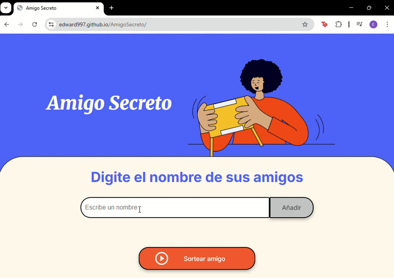

# 📌 Amigo Secreto


## Índice
1. [Descripción del Proyecto](#descripción-del-proyecto)
2. [Estado del Proyecto](#estado-del-proyecto)
3. [Demostración](#demostración)
4. [Acceso al Proyecto](#acceso-al-proyecto)
5. [Tecnologías Utilizadas](#tecnologías-utilizadas)
6. [Personas Desarrolladoras](#personas-desarrolladoras-del-proyecto)

---

## Descripción del Proyecto
En este desafío, desarrollarás una aplicación que permita a los usuarios ingresar nombres de amigos en una lista para luego realizar un sorteo aleatorio y determinar quién es el "amigo secreto".

El usuario deberá agregar nombres mediante un campo de texto y un botón "Adicionar". Los nombres ingresados se mostrarán en una lista visible en la página, y al finalizar, un botón "Sortear Amigo" seleccionará uno de los nombres de forma aleatoria, mostrando el resultado en pantalla.

---

## Estado del Proyecto
✅ Proyecto terminado

---

## Demostración
Aquí puedes incluir capturas de pantalla o gifs mostrando el funcionamiento del proyecto.



---

## Acceso al Proyecto
Puedes acceder al proyecto aquí:  
[🌐 GitHub Pages](https://edward997.github.io/AmigoSecreto/) 

Clonar el repositorio:
[```bash]
   (git clone https://github.com/Edward997/AmigoSecreto.git)

---

## Tecnologías utilizadas

- HTML5 / CSS3 / JavaScript 
- Git, VS Code

---

## Personas Desarrolladoras del Proyecto
Edward Navarrete - Desarrollador Principal
